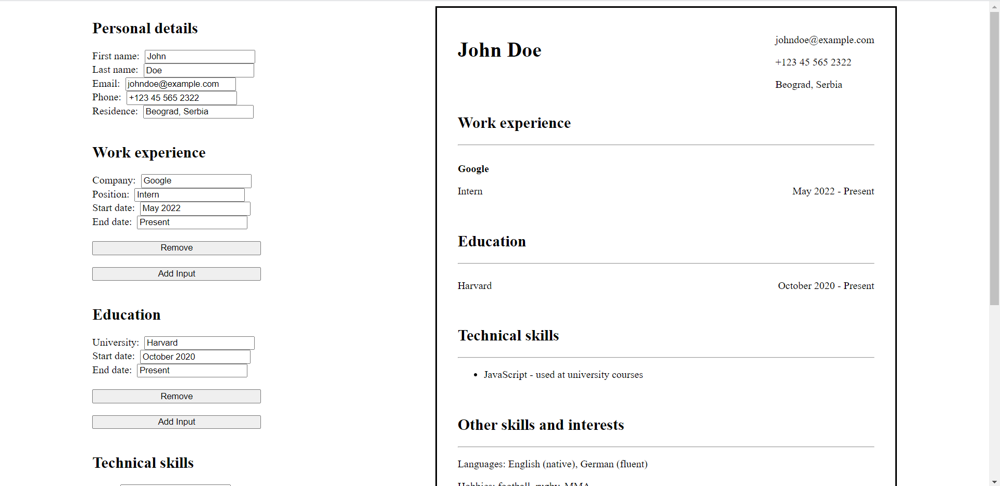

# CV Editor

This is a simple CV editor built with React. It allows users to input basic informations, work experiences, educations and skills.

## Technologies Used

- React
- JavaScript
- HTML
- CSS

## Features

- Edit CV overview
- Add sections to the CV overview
- Remove sections from the CV overview

## Demo

You can play with project online by visiting [CV project Demo](https://ikojun00.github.io/cv-project/)

## Screenshots

